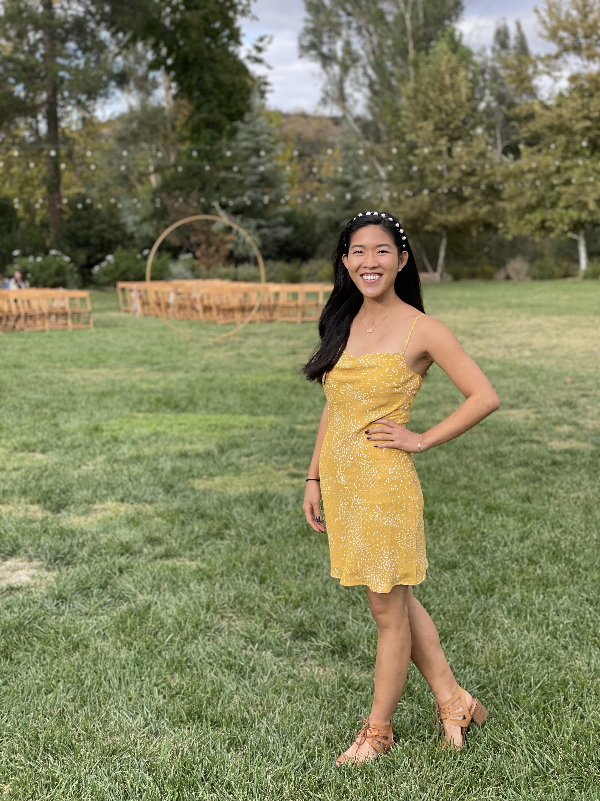

### Meet Jocelyn

Hello! My name is Jocelyn and I am an LA native. I currently attend [Columbia University Mailman School of Public Health](http://www.publichealth.columbia.edu/) where I study biostatistics and epidemiology. My interests include maternal and child health, oncology, and climate change.    

If you would like to learn more about my professional background, please see my [resume](about.html).

\newpage

### Hobbies
When I'm not busy with my typical graduate student responsibilities, I am usually out in search of the *perfect* soup dumplings!  

I also enjoy having an active lifestyle and have found a love for hiking in the upstate New York area. Here's the view of a recent one I went on!

  
  
I'm fairly obsessed with my sister's dog, Diamond. She's an 11-year-old lab/pitty rescue, with the sweetest soul! This is my favorite picture of her:

